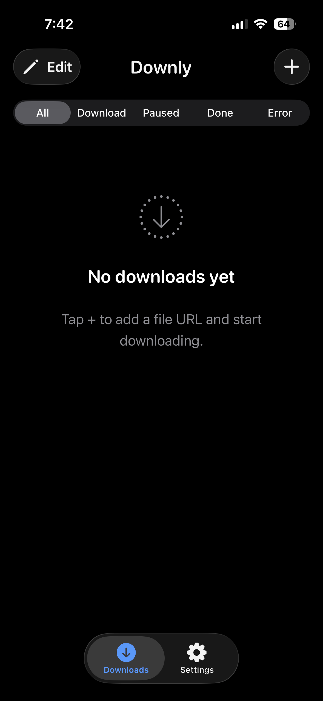
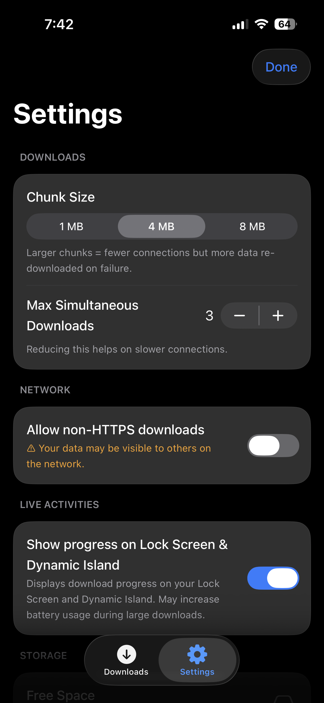

# Downly

Downly is a robust, modern iOS application designed for high-performance file downloading. It features a highly concurrent download engine, advanced queue management, chunked parallel downloads, and native Live Activities integration to track progress right from the Lock Screen and Dynamic Island. 

## Screenshots

  
  &nbsp;&nbsp;&nbsp;
  

## Features

- **Advanced Download Engine**: Handles standard and chunked parallel downloads using modern Swift Concurrency (`async`/`await`, `actor`).
- **Download Queue Management**: Tracks pending, running, and completed downloads with a durable queue.
- **Live Activities**: Native integration with WidgetKit to display real-time download progress on the Lock Screen and Dynamic Island.
- **Persistent State**: Utilizes SwiftData to store download history, chunk records, and queue state, ensuring resilience across app launches.
- **App Group Support**: Shares downloaded files and state seamlessly between the main application and the widget extension using a shared container (`group.com.axoman.downly`).
- **Modern UI**: Built entirely with SwiftUI, featuring iOS 26's "Liquid Glass" native aesthetic.

## Tech Stack

- **UI Framework**: SwiftUI
- **Persistence**: SwiftData
- **Concurrency**: Swift Structured Concurrency (`async`/`await`, `actor`, `TaskGroup`)
- **Networking**: `URLSession`
- **Architecture**: StateObject-driven UI with Actor-isolated services
- **Extensions**: WidgetKit (Live Activities)
- **Deployment Target**: iOS 26.4+

## Project Structure

- `Downly/App/`: Main entry point and lifecycle hooks (e.g., background session completion).
- `Downly/Engine/`: Core download engine, chunk coordinator, and file assembly logic.
- `Downly/Queue/`: Download queue management and real-time progress coordination.
- `Downly/Persistence/`: SwiftData container configuration and write throttling.
- `Downly/Models/`: Data models representing downloads (`DownloadItem`) and chunks (`ChunkRecord`).
- `Downly/UI/`: SwiftUI screens, components, and design system.
- `Downly/LiveActivity/`: Live Activity lifecycle management for the main app.
- `DownlyWidgetExtension/`: The Widget extension target containing the UI for Live Activities.

## Setup Instructions

1. Ensure you have an **Xcode** version installed that supports iOS 26.4+.
2. Clone or download the repository and navigate to the project folder.
3. Open `Downly.xcodeproj`.
4. Check the **Signing & Capabilities** tab:
   - You may need to update the Team and Bundle Identifier if you plan to run on a physical device.
   - Ensure the App Group (`group.com.axoman.downly`) entitlement is correctly configured for your Apple Developer account to allow file sharing and Live Activity updates.

## How to Run

1. Open the project in Xcode.
2. Select the **Downly** scheme from the top toolbar.
3. Choose a Simulator or a connected physical device running **iOS 26.4** or later.
4. Press `Cmd + R` or click the **Play** button to build and run the application.

## Future Improvements

- **Background Session Reliability**: Re-architecting `URLSession` handling to improve reliability when the app is suspended or terminated by the system.
- **Advanced Error Recovery**: Implementing smarter auto-retry and auto-resume mechanisms for transient network drops.
- **Network Adaptive Chunking**: Dynamically adjusting chunk size and thread count based on network conditions.
